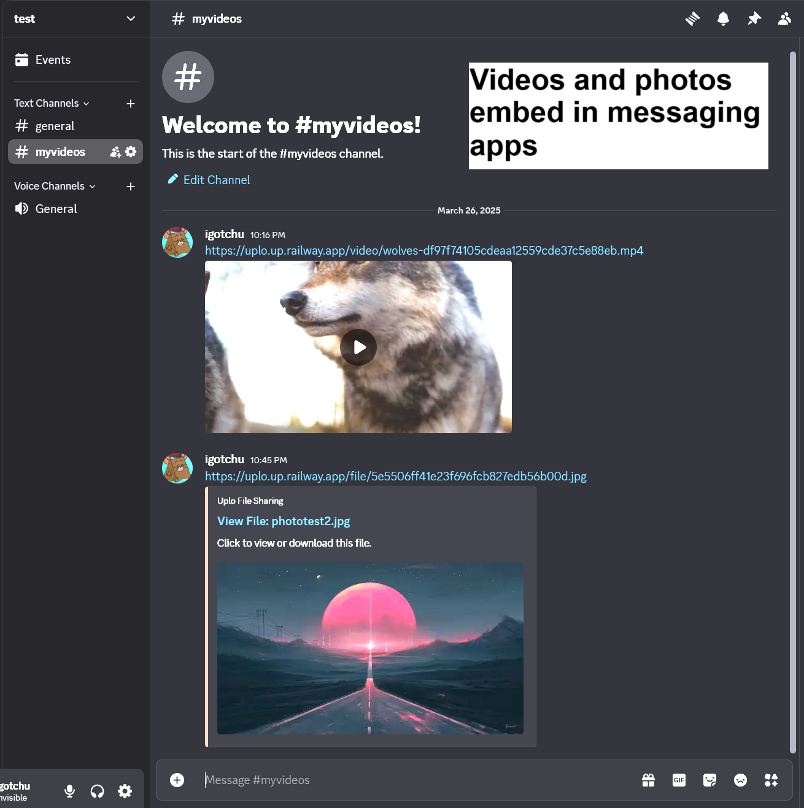

# Uplo FileShare Web App

Check out our website! 
<a>https://uplo.up.railway.app/</a>
  

A lightweight, temporary file-sharing application that allows users to upload files, generate temporary links, and share them effortlessly. Files are stored in AWS S3 and automatically deleted after a set period, ensuring privacy and reducing clutter. "Its like snapchat for files!"

**Bypass file size limits on messaging apps and embed your photos and videos.** 

 

  

 

  

---

## External Requirements

### Amazon S3
- Set up an S3 bucket with proper permissions.

### MySQL Database
- Host a MySQL Database, making sure it can be accessed.

### Web Host
- The app will need to be hosted for users to access over the web.

### Dependencies
1. **Node.js**  
   - Ensure Node.js is installed on your system. Download it from [Node.js Official Site](https://nodejs.org/).

2. **Express**  
   - A web framework for Node.js used to handle API routing and server-side logic.

3. **dotenv**  
   - Used to load environment variables from a `.env` file into your application.

4. **node-fetch**  
   - A lightweight module that allows making HTTP requests from the server.

5. **AWS SDK**  
   - Used to interact with AWS S3 for file uploads and downloads.

6. **MySQL2**  
   - Used to access database for tracking uploads, file sizes, and temporary link expiration.

7. **Archiver**
   - Used to zip folders and files before sending to S3\.

8. **Axios**
   - Used for easy http requests.

9. **BCrypt**
   - Used for secure hashing of data.

10. **Fetch**
    - Function for making http requests.

11. **Luxon**
    - Date and time library.

12. **Multer**
    - Middleware for handling file uploads.

13. **Node-Cron**
    - Scheduler to run tasks at set times and intervals.

14. **Node-Fetch**
    - Function for making http requests.

15. **Progress-Stream**
    - Tracks progress of streams.

16. **socket.io**
    - Allows real-time two-way communication between client and server.
   
---

## Setup
1. **Ensure `Node.js` is installed.**
2. **Clone repository to code editor.**
3. **In the terminal, run this command: `npm init`.**
4. **Create a `.env` and enter all necessary credentials for AWS and MySQL access.**
   (MYSQLHOST, MYSQLUSER, MYSQLPASSWORD, MYSQLDATABASE, MYSQLPORT, AWS_ACCESS_KEY_ID, AWS_SECRET_ACCESS_KEY, AWS_REGION, S3_BUCKET_NAME, BASE_URL)

---

## Tests
1. Ensure that the node server is running by running command: 'node app.js or npm start'.
2. Open a new terminal and ensure that the current directory is the project folder.
3. Now run the test files using command: 'node test_file_of_choice'
4. List of test files:
   - testDeletion.js
   - testInsert.js
   - testRetrieve.js
   - testS3LinkUpdate.js
   - checkIPCount.js

---

### Authors
- Joey Gomez
- Chris Guevara
- Moeeza Nasir
- Alan Chu

  
